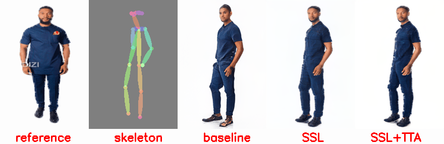
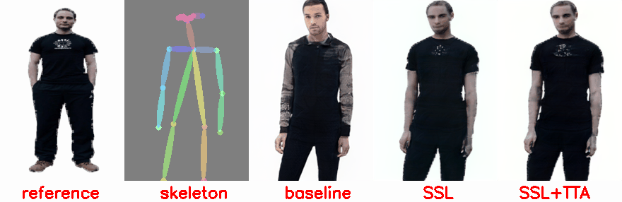
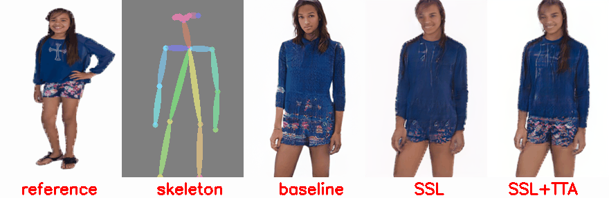
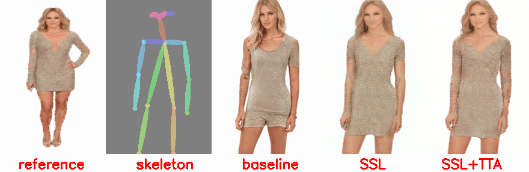
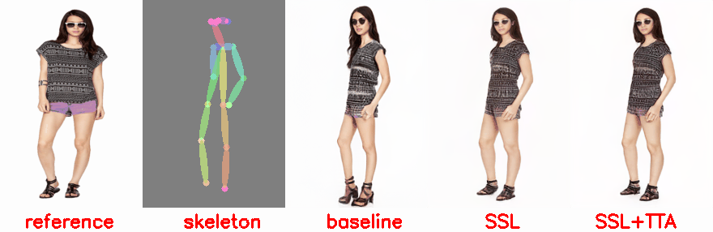

# TTA_pose_transfer

## Image_TTA
**We propose to capture human appearance from Out-of-distribution data via Self-supvised learning.(SSL)**

**Furthermore, we use motion consistency loss as an auxiliary loss during Test-Time to maintain appearance stability.(TTA)**

